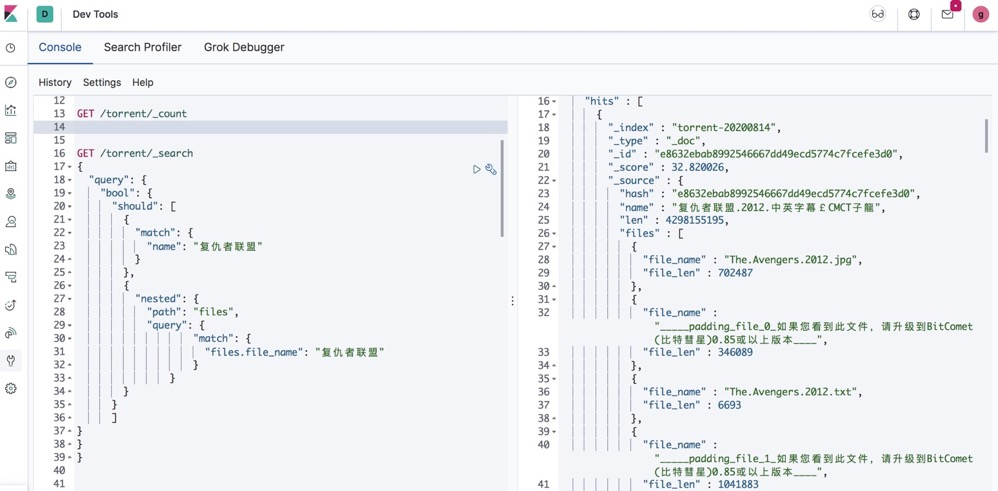

# DHTsimple

# 简介
DHT全称叫分布式哈希表(Distributed Hash Table)，是一种分布式存储方法。在不需要服务器的情况下，每个客户端负责一个小范围的路由，并负责存储一小部分数据，从而实现整个DHT网络的寻址和存储。连入DHT网络的用户叫做节点(node)，节点之间互相有路由记录，因此只要和任何一个已经在DHT网络中的节点连接上，客户端就可以寻找到更多的节点，从而连入网络。它可以在DHT网络中寻找下载同一文件的其他用户。BitComet的DHT网络协议和BitTorrent测试版的协议完全兼容，也就是说可以连入一个同DHT网络分享数据。

总的来说就是我们需要构造一个节点加入一个DHT网络中，然后认识更多其他的节点，从而在节点之间的通讯中获得其中的Torrent信息，然后下载获得元数据，这里是直接把元数据存到了es中。

